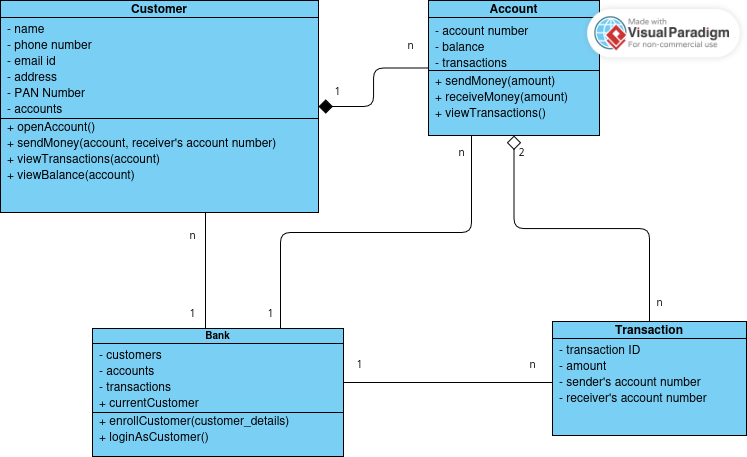

# Software Engineering Lab Project

A simple **banking system simulation** implemented in C++.  
This project demonstrates **object-oriented design** using multiple classes (`Bank`, `Customer`, `Account`, and `Transaction`) to model the core entities in a bank.

<br>

# UML Diagram



<br>

## 🔧 How to Run

1. **Clone the repository**
   ```bash
   git clone <repo-url>
   cd <repo-folder>
   ```

2. **Compile the project**  
   You can use `g++`:
   ```bash
   g++ *.cpp -o bank_working
   ```

3. **Run the executable**
   ```bash
   ./bank_working
   ```

<br>

## 📂 File Structure
```
root
├── Account.h / Account.cpp           # Defines the Account class
├── Bank.h / Bank.cpp                 # Defines the Bank class
├── Customer.h / Customer.cpp         # Defines the Customer class
├── Transaction.h / Transaction.cpp   # Defines the Transaction class
├── main.cpp                          # Entry point to run the program
├── README.md                         # Documentation
└── .gitignore                        # Git ignore rules
```

<br>


## 🏗️ Class Overview

### **Bank**
- Manages customers, accounts, & transactions.
- Provides functions to add customers and create accounts.

### **Customer**
- Represents a bank’s customer.
- Stores name, PAN Number, contact info and associated accounts.
- Provides functions to send and receive money, view transactions and view balance.

### **Account**
- Represents a bank account with balance.
- Linked to a customer.
- Allows deposits and withdrawals.

### **Transaction**
- Represents deposits and withdrawals.
- Stores transaction ID, type, amount, and timestamp.

<br>


## 📝 Example Usage
- Creates 2 customers, Ramesh and Vishish
- Creates 2 accounts for Ramesh and 1 account for Vidhish
- Login as Ramesh
- Sends money to Vidhish
- View balance of all 3 accounts
- View Transactions
- Sends money to Vishish
- Show all transactions
- View Transactions of all 3 accounts.


